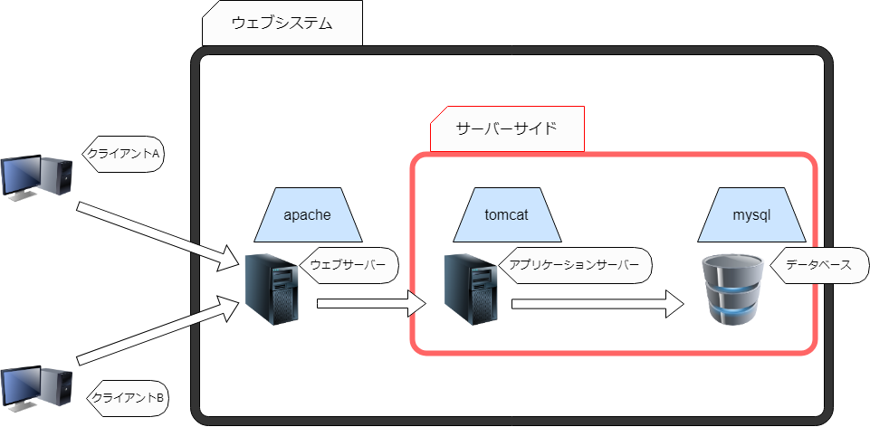

# フレームワークとは何ぞや？

## IEやchromeでwebサイトが表示される仕組みを知る

主題の「フレームワークとは何ぞや？」ということを考えるにあたって
webアプリが提供される仕組みを知っておくことが重要だと考える。
なのでここですこし解説しておく。

- クライアントはブラウザを利用してウェブシステムにアクセスする。
- ウェブサーバーはクライアントからのリクエストを受け取り、必要に応じてアプリケーションサーバーにアクセスする。
- アプリケーションサーバーはクライアントのリクエストに対して適切なレスポンス(HTMLなどのデータ)をウェブサーバーに返却する。
- ウェブサーバーはアプリケーションサーバーからのレスポンスをクライアントへを返却する。
- クライアント(ブラウザ)は返却されたデータを表示する。 

とても大雑把だが、現代のウェブシステムのほとんどがこの構成でインターネットサービスを提供している。

また、各名称は様々である。

ウェブシステム：ウェブサービス、システム、など

サーバーサイド：バックエンド、など

研修で作成した.jspや.javaなどのプログラムは`アプリケーションサーバー`で動作することになる。

※研修中に触れたであろうミドルウェアとの対応を青背景で表現している。

※1つの矢印で`リクエスト`と`レスポンス`を表現している。矢印の方向はリクエストの向き。

## ウェブフレームワークが働く場所

いわゆるサーバーサイド言語(javaなど)は上記の構成図でいうと`アプリケーションサーバー`で実行される。

なので多くのウェブフレームワークも同様に`アプリケーションサーバー`で働くことになる。

## プログラミング言語が変わるとフレームワークも変わる

フレームワークは主にその言語で作られているので言語ごとに対応したフレームワークを使用する必要がある。

java   : Spring Boot

ruby   : ruby on rails

python : Django

といったような感じ、これはほんの一部の例なので一度ググってみるといいかも。

研修はjavaなので、もちろんjavaに対応したSpring Bootが登場します。

## フレームワークを使用するとなぜhappyなのか？

**フレームワークを使用してウェブアプリケーションを開発すると何がうれしいのか。**

**フレームワークは何を提供してくれるのか。**

という問いについて考えていきたい。

まずは、世界の頭脳 Wikipedia での定義を見るとこう書いてある。

> Web アプリケーションフレームワークは、
> 動的な ウェブサイト、Webアプリケーション、Webサービスの開発をサポートするために設計されたアプリケーションフレームワークである。
> フレームワークの目的は、Web開発で用いられる共通した作業に伴う労力を軽減することである。
> たとえば、多数のフレームワークがデータベースへのアクセスのためのライブラリや、テンプレートエンジン（→Webテンプレート）、
> セッション管理を提供し、コードの再利用を促進させるものもある。

# 「jsフレームワークって何やってるの」について調査したのでまとめる

調査するときの観点として、Spring Boot などのサーバーサイドウェブフレームワークとの役割の違いに着目した。

> 調査している途中でそもそもやってることが全然違うことに気が付いたので違いを探すことはやめた。w

## webサイトのページがブラウザで表示される仕組みを知る。

- ブラウザからリクエストを投げて帰ってくるまでの1例
- HTMLが生成されるタイミングの解説
- ブラウザ(Client side)はHTMLを表示する

## 用語解説
### DOM

> Document Object Model

HTMLの各タグの入れ子構造を階層構造として表現したデータモデルjavascriptなどで扱えるようにするために変換している。

